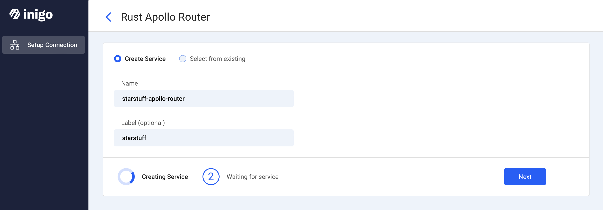
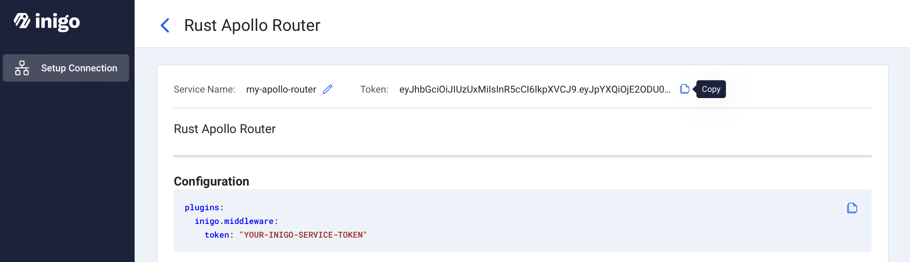
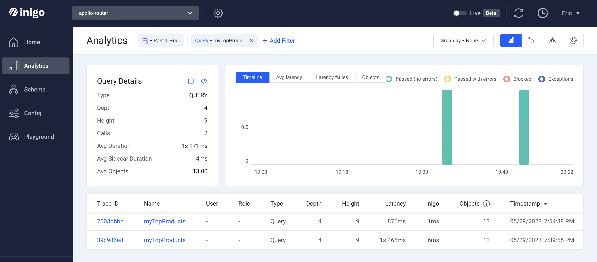

# Inigo Apollo Router Kubernetes Demo

This project demonstrates how to use Inigo with Apollo Router which is deployed onto Kubernetes using Helm.

This project uses the following:

1. [Inigo Rust Apollo Router](https://docs.inigo.io/deployment/rust_apollo_router)
2. [Apollo Router Helm Chart](https://github.com/apollographql/router/tree/v1.19.0/helm/chart/router)

## 1. Create Apollo Router in Inigo

In the Inigo dashboard, you must setup an Apollo Router and copy the Inigo token.





## 2. Add your Inigo Token to `values.yaml`

```
    plugins:
      inigo.middleware:
        token: "ey...
```

## 3. Create k3d Kubernetes Cluster

[k3d](https://k3d.io) allows  you to run Kubernetes on your local machine.


```
k3d cluster create inigo -p "8080:80@loadbalancer" -p "8443:443@loadbalancer"
```

## 4. Install Apollo Router (Inigo Build)


```
helm install --create-namespace --namespace apollo-router apollo-router oci://ghcr.io/apollographql/helm-charts/router  --set-file supergraphFile="starstuff.graphql" --values values.yaml
```

### Check Apollo Router Pods

Make sure the pod is running and ready

```
kubectl get pods -n apollo-router
```

## 5. Execute Sample GraphQL Query

Use `curl` to execute a GraphQL query against the `starstuff.graphql` supergraph schema. 

```
query='query myTopProducts {
  me {
    name
  }
  topProducts {
    name,
    price,
    reviews {
        author {
            name
        }
        body
    }
  }
}'
variables='{}'
curl -i -X POST http://localhost:8080 \
  -H 'Host: apollo-router.local' \
  -H 'Content-Type: application/json' \
  -d @- <<EOF
      {"query": "$(echo $query)", "variables": $variables}
EOF
```

### Expected Result

```
HTTP/1.1 200 OK
content-type: application/json
vary: origin
content-length: 416
date: Tue, 30 May 2023 02:39:56 GMT

{"data":{"me":{"name":"Ada Lovelace"},"topProducts":[{"name":"Table","price":899,"reviews":[{"author":{"name":"Ada Lovelace"},"body":"Love it!"},{"author":{"name":"Alan Turing"},"body":"Prefer something else."}]},{"name":"Couch","price":1299,"reviews":[{"author":{"name":"Ada Lovelace"},"body":"Too expensive."}]},{"name":"Chair","price":54,"reviews":[{"author":{"name":"Alan Turing"},"body":"Could be better."}]}]}}
```

## Check Inigo for GraphQL Query Data

Find the queries for `myTopProducts` in the Inigo Dashboard.

